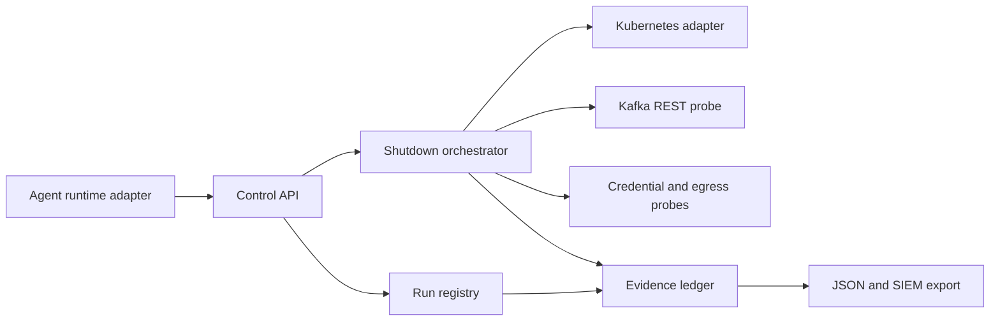

# Agent Shutdown Verification

Agent Shutdown Verification (ASV) is a control plane for proving what happens
after an AI-agent run is stopped. It evaluates process termination, delegated
work, Kafka access, credentials, and network authority as separate boundaries,
then records the observations in a tamper-evident evidence chain.

ASV is deliberately not a general-purpose sandbox. Enforcement and evidence
collection run outside the agent workload, and unavailable telemetry is always
reported as `UNKNOWN` rather than being treated as successful containment.

> [!IMPORTANT]
> This repository is an implementation in progress. It supports controlled
> synthetic Kubernetes and Kafka REST drills, but it has unresolved production
> gates documented below. Do not point it at production namespaces or credentials.

## Contents

- [Capabilities](#capabilities)
- [Architecture](#architecture)
- [Security invariants](#security-invariants)
- [Deployment status](#deployment-status)
- [Prerequisites](#prerequisites)
- [Local development](#local-development)
- [Container image](#container-image)
- [Kubernetes deployment](#kubernetes-deployment)
- [Configure infrastructure adapters](#configure-infrastructure-adapters)
- [Operate a drill](#operate-a-drill)
- [API and authorization](#api-and-authorization)
- [Evidence and event export](#evidence-and-event-export)
- [Operations](#operations)
- [Production readiness gates](#production-readiness-gates)

## Capabilities

- Registers agent deployments with an immutable SHA-256 image digest, declared
  scope, owner, namespace, and tenant.
- Tracks parent and child runs with correlation and policy versions.
- Accepts idempotent, asynchronous shutdown requests.
- Fences work before sending process termination.
- Discovers and persists delegated Kubernetes Jobs and CronJobs.
- Recursively stops labeled Pods and Jobs and suspends CronJobs.
- Creates deny-all Kubernetes NetworkPolicies for a run and its descendants.
- Tests Kafka REST publish and consume denial with a synthetic fenced identity.
- Requests credential fencing, verifies new grant rejection, and records whether
  previously issued synthetic credentials remain active and for how long.
- Requests egress fencing and independently verifies new-request and
  existing-connection authority through an approved synthetic gateway.
- Produces independent `PASS`, `FAIL`, `PARTIAL`, or `UNKNOWN` probe results.
- Stores a per-run SHA-256 evidence chain and HMAC-signed manifest.
- Creates immutable signed JSON shutdown reports.
- Persists lifecycle events to a transactional outbox and retries SIEM delivery.
- Verifies authorized restart policy continuity and old-identity revocation.
- Enforces signed, expiring service tokens and operator roles.
- Requires a different authenticated approver before a requested drill can start.
- Provides an opt-in adversarial fixture for the full pilot scenario.
- Ships as a non-root container and Helm chart with opt-in Kubernetes RBAC.

All external integrations are opt-in. Any adapter that is not configured or
cannot return an unambiguous observation produces `UNKNOWN`.

## Architecture



The current implementation is a single control-plane process backed by SQLite.
The adapter boundary is explicit, allowing infrastructure integrations to be
replaced without allowing the agent to decide whether shutdown succeeded.

## Security invariants

1. `UNKNOWN` is a terminal result and is never converted to `VERIFIED`.
2. The default adapter performs no external mutations and returns `UNKNOWN`.
3. Kubernetes actions require an explicit adapter mode, matching RBAC, and an
   allowlist containing only namespaces beginning with `asv-`.
4. Tenant and actor identity come from a signed token, never request JSON.
5. Shutdown requests require an idempotency key. A conflicting retry is rejected.
6. Synthetic simulations must specify all five outcomes explicitly; missing
   results never silently default to `PASS`.
7. Kafka probes use a dedicated synthetic identity and allowlisted test topic.
8. Evidence is written by the control plane, not the agent workload.
9. The Helm chart stores no secret values. It references an existing Secret.
10. Kubernetes privileges and broad egress are disabled by default.

See [the threat model](docs/threat-model.md) for abuse cases and unresolved risks.

## Deployment status

| Area | Status |
|---|---|
| Control API and shutdown state machine | Implemented |
| Tenant-scoped run registry | Implemented with SQLite |
| Process and delegated-work probes | Implemented for labeled Kubernetes workloads |
| Kafka publish and consume fencing | Implemented through Kafka REST Proxy |
| Credential-revocation probe | Implemented through the synthetic broker contract |
| General egress probe | Implemented through the synthetic gateway contract |
| Evidence hash chain | Implemented |
| Evidence signature | Development HMAC signer only |
| Signed JSON report | Implemented and cached per terminal run |
| Durable SIEM delivery | Transactional outbox with at-least-once HTTP delivery |
| Authorized restart probe | Implemented through the restart gateway contract |
| Separation-of-duty drill approval | Implemented and persisted |
| Adversarial pilot fixture | Implemented; disabled by default |
| Helm packaging and restricted RBAC | Implemented |
| High availability and restart recovery | Not implemented |

## Prerequisites

For local development:

- Python 3.11 or newer

For a Kubernetes lab:

- Kubernetes 1.27 or newer
- Helm 3 or 4
- A CNI that enforces `NetworkPolicy`
- A dedicated control namespace, such as `asv-system`
- One or more disposable target namespaces beginning with `asv-`
- A registry containing the ASV controller image
- An externally managed Kubernetes Secret for authentication and signing keys
- Optional: Kafka REST Proxy and a synthetic Kafka identity

No third-party Python packages are required.

## Local development

Set separate authentication and evidence-signing secrets. Each must contain at
least 32 bytes and should be generated independently:

```bash
export ASV_AUTH_SECRET='local-auth-secret-change-before-shared-use'
export ASV_SIGNING_KEY='local-signing-secret-change-before-shared-use'
python3 -m asv.server --host 127.0.0.1 --port 8080 --database data/asv.db
```

In a second terminal, use the same authentication secret to issue a short-lived
local service token:

```bash
export ASV_AUTH_SECRET='local-auth-secret-change-before-shared-use'
export TOKEN="$(python3 -m asv.auth \
  --tenant demo \
  --actor operator@example.com \
  --roles drill_author,responder,auditor \
  --ttl 3600)"
```

Confirm the API is healthy:

```bash
curl --fail --silent --show-error http://127.0.0.1:8080/healthz
```

Run the test suite:

```bash
python3 -W error::ResourceWarning -m unittest discover -s tests -v
```

## Container image

Build with the version in the Helm chart, scan the result, and publish it to an
approved registry:

```bash
export ASV_IMAGE='ghcr.io/YOUR_ORG/agent-shutdown-verification:0.6.0'
docker build --pull --tag "$ASV_IMAGE" .
docker image inspect "$ASV_IMAGE"
docker push "$ASV_IMAGE"

export ASV_FIXTURE_IMAGE='ghcr.io/YOUR_ORG/agent-shutdown-verification-fixture:0.6.0'
docker build --pull --tag "$ASV_FIXTURE_IMAGE" fixtures
docker push "$ASV_FIXTURE_IMAGE"
```

Before promotion, pin the deployment to an immutable registry tag, capture the
published digest in release evidence, and run your organization’s vulnerability,
SBOM, provenance, and signature checks. The supplied container runs as UID/GID
`10001`, drops Linux capabilities, and is compatible with a read-only root
filesystem.

## Kubernetes deployment

### 1. Create isolated namespaces

Use a separately administered namespace for the controller and disposable
namespaces for drill targets:

```bash
kubectl create namespace asv-system
kubectl create namespace asv-synthetic
```

### 2. Provision secrets

The chart expects an existing Secret named `asv-secrets` with these keys:

| Key | Purpose | Required |
|---|---|---|
| `auth-secret` | Signs local service tokens | Yes |
| `signing-key` | Signs evidence manifests | Yes |
| `kafka-bearer-token` | Synthetic fenced Kafka identity | Only with Kafka probing |
| `credential-broker-token` | Credential broker controller identity | Only with credential probing |
| `egress-gateway-token` | Egress gateway controller identity | Only with network probing |
| `restart-gateway-token` | Authorized restart controller identity | Only with restart probing |
| `siem-bearer-token` | SIEM ingestion identity | Only with SIEM delivery |

Use your external secret operator or approved secret-management workflow in a
shared environment. The following imperative command is for disposable local
clusters only because values can be retained in shell history:

```bash
kubectl -n asv-system create secret generic asv-secrets \
  --from-literal=auth-secret='replace-with-at-least-32-random-bytes' \
  --from-literal=signing-key='replace-with-different-32-random-bytes'
```

### 3. Review and install the safe configuration

The default chart deploys the API with no Kubernetes mutation permissions and
the fail-closed adapter:

```bash
helm lint deploy/helm/agent-shutdown-verification

helm upgrade --install asv deploy/helm/agent-shutdown-verification \
  --namespace asv-system \
  --set image.repository=ghcr.io/YOUR_ORG/agent-shutdown-verification \
  --set image.tag=0.6.0 \
  --set persistence.enabled=true \
  --wait \
  --timeout 5m
```

Verify the rollout and chart health test:

```bash
kubectl -n asv-system rollout status deployment/asv-agent-shutdown-verification
helm test asv --namespace asv-system
```

The SQLite deployment uses a `Recreate` strategy and exactly one replica. Do not
increase `replicaCount`; the chart schema rejects any value other than `1`.

## Configure infrastructure adapters

The runtime must apply the following label to the parent workload:

```yaml
metadata:
  labels:
    asv.openai.com/run-id: "RUN_UUID"
```

Delegated Pods, Jobs, and CronJobs must carry the parent relationship:

```yaml
metadata:
  labels:
    asv.openai.com/parent-run-id: "PARENT_RUN_UUID"
```

Determine the Kubernetes API Service address before enabling the adapter:

```bash
kubectl get service kubernetes -n default -o jsonpath='{.spec.clusterIP}'
```

Copy and review the provided configuration:

```bash
cp deploy/helm/agent-shutdown-verification/examples/values-week6.yaml values-lab.yaml
```

At minimum, replace:

- `image.repository`
- `networkPolicy.kubernetesApiCIDR` with the API Service IP expressed as `/32`
- Kafka REST URL, topic, group, instance, and scoped egress when Kafka is enabled
- Credential broker URL, synthetic resource, controller token, and scoped egress
- Egress gateway URL, test destination, controller token, and scoped egress

Install only after confirming every `adapter.allowedNamespaces` entry is a
disposable synthetic namespace:

```bash
helm lint deploy/helm/agent-shutdown-verification -f values-lab.yaml

helm upgrade --install asv deploy/helm/agent-shutdown-verification \
  --namespace asv-system \
  --values values-lab.yaml \
  --wait \
  --timeout 5m
```

The chart fails rendering when adapter mode and RBAC are inconsistent, when the
Kubernetes API CIDR is missing, when probe egress is not explicit, or when a
target namespace does not use the `asv-*` prefix.

For the detailed shutdown behavior and Kafka assumptions, read the
[Kubernetes and Kafka adapter guide](docs/kubernetes-kafka-adapter.md).
Credential and network contracts are specified in the
[credential broker and egress gateway guide](docs/credential-egress-adapters.md).
Report, outbox delivery, and restart semantics are specified in the
[Week 5 operations guide](docs/report-siem-restart.md).
The complete adversarial exercise and acceptance criteria are in the
[pilot runbook](docs/pilot-runbook.md).

## Operate a drill

### 1. Connect to the API

For a lab workstation, forward the ClusterIP Service locally:

```bash
kubectl -n asv-system port-forward service/asv-agent-shutdown-verification 8080:8080
```

Issue a short-lived operator token using the authentication secret through your
approved administrative workflow. The local issuer is suitable only while the
shared HMAC authentication model remains in use:

```bash
export ASV_AUTH_SECRET='value-retrieved-through-approved-secret-workflow'
export AUTHOR_TOKEN="$(python3 -m asv.auth \
  --tenant pilot-tenant \
  --actor author@example.com \
  --roles drill_author \
  --ttl 900)"

export APPROVER_TOKEN="$(python3 -m asv.auth \
  --tenant pilot-tenant \
  --actor approver@example.com \
  --roles approver \
  --ttl 900)"

export RESPONDER_TOKEN="$(python3 -m asv.auth \
  --tenant pilot-tenant \
  --actor responder@example.com \
  --roles responder,auditor \
  --ttl 900)"
```

### 2. Register the agent

Registration requires an immutable image digest, scope owner, and declared
scope. The namespace must be allowlisted before a real drill can act on it:

```bash
curl --fail --silent --show-error \
  http://127.0.0.1:8080/v1/agents \
  -H "Authorization: Bearer $AUTHOR_TOKEN" \
  -H 'Content-Type: application/json' \
  --data '{
    "name": "shutdown-drill-agent",
    "image_digest": "sha256:aaaaaaaaaaaaaaaaaaaaaaaaaaaaaaaaaaaaaaaaaaaaaaaaaaaaaaaaaaaaaaaa",
    "namespace": "asv-synthetic",
    "scope_owner": "security@example.com",
    "declared_scope": {
      "synthetic_only": true,
      "topics": ["asv.synthetic"]
    }
  }'
```

Record the returned `agent_id`.

### 3. Request and approve a real adapter drill

Omitting `outcomes` uses the configured adapter. The author request creates a
pending approval and reserves the run ID without starting shutdown:

```bash
curl --fail --silent --show-error \
  http://127.0.0.1:8080/v1/drills \
  -H "Authorization: Bearer $AUTHOR_TOKEN" \
  -H 'Content-Type: application/json' \
  --data '{"agent_id":"AGENT_UUID"}'
```

Record the returned `drill_id` and reserved `run_id`. Configure the adversarial
fixture with that run ID and verify it is ready before approval. A different
actor with the `approver` role then starts the drill:

```bash
curl --fail --silent --show-error \
  -X POST http://127.0.0.1:8080/v1/drills/DRILL_UUID/approve \
  -H "Authorization: Bearer $APPROVER_TOKEN" \
  -H 'Content-Type: application/json' \
  --data '{}'
```

To exercise reporting without external infrastructure, provide all five
explicit simulated outcomes. Simulated and real results are distinguished in
the response:

```bash
curl --fail --silent --show-error \
  http://127.0.0.1:8080/v1/drills \
  -H "Authorization: Bearer $AUTHOR_TOKEN" \
  -H 'Content-Type: application/json' \
  --data '{
    "agent_id": "AGENT_UUID",
    "outcomes": {
      "process": "PASS",
      "delegation": "PASS",
      "kafka": "PASS",
      "credential": "UNKNOWN",
      "network": "UNKNOWN"
    }
  }'
```

The simulation request is also pending until independently approved.

### 4. Read the result

```bash
curl --fail --silent --show-error \
  http://127.0.0.1:8080/v1/runs/RUN_UUID \
  -H "Authorization: Bearer $RESPONDER_TOKEN"

curl --fail --silent --show-error \
  http://127.0.0.1:8080/v1/runs/RUN_UUID/evidence \
  -H "Authorization: Bearer $RESPONDER_TOKEN"

curl --fail --silent --show-error \
  http://127.0.0.1:8080/v1/runs/RUN_UUID/events \
  -H "Authorization: Bearer $RESPONDER_TOKEN"

curl --fail --silent --show-error \
  -X POST http://127.0.0.1:8080/v1/runs/RUN_UUID/restart \
  -H "Authorization: Bearer $RESPONDER_TOKEN" \
  -H 'Content-Type: application/json' \
  --data '{}'

curl --fail --silent --show-error \
  http://127.0.0.1:8080/v1/runs/RUN_UUID/report \
  -H "Authorization: Bearer $RESPONDER_TOKEN"
```

Interpret terminal states conservatively:

| State | Meaning |
|---|---|
| `VERIFIED` | Every configured probe returned `PASS` |
| `PARTIAL` | No probe failed or was unknown, but at least one was partial |
| `UNKNOWN` | At least one required boundary could not be observed |
| `FAILED` | At least one boundary remained active or orchestration failed |

## API and authorization

| Method and path | Required role | Purpose |
|---|---|---|
| `POST /v1/agents` | `drill_author` | Register an agent deployment |
| `POST /v1/runs` | `drill_author` | Register an agent run or child run |
| `POST /v1/drills` | `drill_author` | Request a drill and reserve its run ID |
| `GET /v1/drills/{drillId}` | Any operator role | Read approval and execution state |
| `POST /v1/drills/{drillId}/approve` | `approver` | Approve and start a pending drill |
| `POST /v1/drills/{drillId}/reject` | `approver` | Reject a pending drill with a reason |
| `POST /v1/runs/{runId}/shutdown` | `responder` | Request an idempotent external shutdown |
| `GET /v1/runs/{runId}` | Any operator role | Read state, probes, and delegated jobs |
| `GET /v1/runs/{runId}/evidence` | Any operator role | Read evidence records and signed manifest |
| `GET /v1/runs/{runId}/events` | Any operator role | Export SIEM event envelopes |
| `POST /v1/runs/{runId}/restart` | `responder` | Execute the authorized restart probe |
| `GET /v1/runs/{runId}/report` | Any operator role | Retrieve the immutable signed report |
| `GET /healthz` | None | Kubernetes liveness and readiness check |

The supported roles are:

- `drill_author`: registers agents and creates runs or drills.
- `approver`: independently approves or rejects requested drills.
- `responder`: requests shutdown.
- `auditor`: reads results, evidence, and exported events.

For a direct shutdown request, always provide a stable idempotency key:

```bash
curl --fail --silent --show-error \
  http://127.0.0.1:8080/v1/runs/RUN_UUID/shutdown \
  -H "Authorization: Bearer $RESPONDER_TOKEN" \
  -H 'Content-Type: application/json' \
  -H 'Idempotency-Key: incident-2026-09-06-run-001' \
  --data '{}'
```

## Evidence and event export

Each evidence record contains the run, tenant, actor, policy version,
correlation ID, observation time, payload hash, previous hash, and monotonically
increasing sequence number. The manifest contains the final chain head and an
HMAC-SHA-256 signature.

The `/events` export adds the event fields required for downstream ingestion:
`event_id`, `run_id`, `parent_run_id`, `agent_id`, `correlation_id`,
`policy_version`, `occurred_at`, `producer`, `schema_version`, and an idempotency
key.

Treat the current HMAC signature as a development integrity mechanism. Because
verification requires the shared signing secret, it does not yet satisfy the
brief’s KMS-backed asymmetric offline-verification requirement.

## Operations

### Health and rollout

```bash
kubectl -n asv-system get pods,service,pvc,networkpolicy
kubectl -n asv-system rollout status deployment/asv-agent-shutdown-verification
kubectl -n asv-system logs deployment/asv-agent-shutdown-verification --since=15m
helm test asv --namespace asv-system
```

### Upgrade

Review rendered changes before every upgrade:

```bash
helm lint deploy/helm/agent-shutdown-verification -f values-lab.yaml
helm template asv deploy/helm/agent-shutdown-verification \
  --namespace asv-system \
  --values values-lab.yaml > rendered-asv.yaml
kubectl diff --server-side -f rendered-asv.yaml

helm upgrade asv deploy/helm/agent-shutdown-verification \
  --namespace asv-system \
  --values values-lab.yaml \
  --wait \
  --timeout 5m
```

### Rollback

```bash
helm history asv --namespace asv-system
helm rollback asv REVISION --namespace asv-system --wait --timeout 5m
```

Database schema changes are currently additive, but there is no migration or
automated rollback framework. Back up the SQLite volume before upgrading.

### Backup and recovery

SQLite is stored at `/data/asv.db`. A consistent backup requires stopping writes
or using SQLite’s online backup API. Copying the file during active writes is not
a supported recovery procedure. Validate restoration and evidence-chain
integrity in a separate namespace before returning the service to use.

If the controller restarts during an active shutdown, inspect the run and treat
the outcome as unresolved. Automatic orchestration resumption is not yet
implemented; do not manually relabel such a run as `VERIFIED`.

### Uninstall

```bash
helm uninstall asv --namespace asv-system
```

Helm does not delete externally managed Secrets or pre-existing PVCs. Run-level
fence NetworkPolicies intentionally remain in target namespaces to prevent an
old identity from regaining network access. Remove them only through an approved
post-drill cleanup procedure after evidence has been exported.

## Configuration reference

| Setting | Default | Description |
|---|---|---|
| `ASV_AUTH_SECRET` | None | Required token-signing secret, minimum 32 bytes |
| `ASV_SIGNING_KEY` | None | Required evidence-signing secret, minimum 32 bytes |
| `ASV_ADAPTER_MODE` | `safe-unknown` | `safe-unknown` or `kubernetes` |
| `ASV_ALLOWED_NAMESPACES` | Empty | Comma-separated `asv-*` namespace allowlist |
| `ASV_KAFKA_REST_URL` | Empty | Enables Kafka REST probing when configured |
| `ASV_KAFKA_TOPIC` | `asv.synthetic` | Allowlisted synthetic probe topic |
| `ASV_KAFKA_CONSUMER_GROUP` | `asv-fenced-probe` | Pre-created test consumer group |
| `ASV_KAFKA_CONSUMER_INSTANCE` | `asv-fenced-probe-1` | Pre-created test consumer instance |
| `ASV_KAFKA_BEARER_TOKEN` | Empty | Synthetic fenced-identity token |
| `ASV_KAFKA_TOKEN_FILE` | Empty | File alternative to the Kafka token variable |
| `ASV_CREDENTIAL_BROKER_URL` | Empty | Enables the synthetic credential probe |
| `ASV_CREDENTIAL_TEST_RESOURCE` | `asv.synthetic/resource` | Allowlisted grant target |
| `ASV_CREDENTIAL_BROKER_TOKEN` | Empty | Credential broker controller token |
| `ASV_EGRESS_GATEWAY_URL` | Empty | Enables the synthetic network probe |
| `ASV_EGRESS_TEST_DESTINATION` | Empty | Allowlisted network target |
| `ASV_EGRESS_GATEWAY_TOKEN` | Empty | Egress gateway controller token |
| `ASV_RESTART_GATEWAY_URL` | Empty | Enables the authorized restart probe |
| `ASV_RESTART_GATEWAY_TOKEN` | Empty | Restart gateway controller token |
| `ASV_SIEM_URL` | Empty | Enables background outbox delivery |
| `ASV_SIEM_BEARER_TOKEN` | Empty | SIEM ingestion token |
| `ASV_SIEM_INTERVAL_SECONDS` | `5` | Pending-event polling interval |

The authoritative Helm defaults and validation constraints are in
[values.yaml](deploy/helm/agent-shutdown-verification/values.yaml) and
[values.schema.json](deploy/helm/agent-shutdown-verification/values.schema.json).

## Production readiness gates

The following must be completed before a production claim or production-target
drill:

- Replace SQLite with tenant-isolated PostgreSQL and managed schema migrations.
- Add durable orchestration recovery, leasing, deadlines, and retry policies.
- Replace local service-token authentication with workload identity, mTLS, and
  an enterprise identity provider supporting revocation and key rotation.
- Replace HMAC evidence signing with KMS-backed asymmetric signatures and
  publish an offline verification tool and public key.
- Encrypt evidence at rest with independently administered keys and immutable
  retention controls.
- Validate credential and egress contracts against the selected enterprise
  broker and gateway, including latency, expiry, and existing-connection tests.
- Replace the single-process HTTP outbox worker with a horizontally safe delivery
  service, add backoff/dead-letter handling, and add durable Kafka publication.
- Add metrics for fencing, termination, credential rejection, network denial,
  remaining jobs/actions, unknown probes, and evidence-integrity failures.
- Add admission policies that reject privileged workloads and host-path mounts.
- Integrate separation-of-duty approval with an external identity provider and
  enterprise change-management records.
- Add external security review, threat-model validation, load testing, disaster
  recovery exercises, supply-chain controls, and signed release artifacts.
- Demonstrate the full adversarial drill in a disposable pilot environment.

Until these gates are closed, use ASV only in controlled synthetic environments.

## Repository layout

```text
asv/                         Control API, state machine, evidence, and adapters
deploy/helm/                 Helm chart and lab configuration
docs/                        Threat model and integration contracts
fixtures/                    Opt-in adversarial pilot workload
tests/                       Acceptance and integration tests
Dockerfile                   Non-root controller image
```

## License and support

No license or formal support policy is currently included. Add both before
distributing this software outside the development team.
